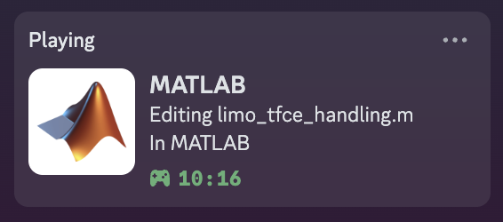

# MATLAB Discord Rich Presence Integration

**Author**: Devon Yanitski and Gemini CLI 0.1.13

This toolbox integrates Discord Rich Presence with MATLAB, allowing you to display the `.m` file you are currently editing in your Discord status. It automatically updates as you switch between files, similar to the VS Code "vscord" extension.



## Features

- **Automatic Detection**: Shows the currently active file in the MATLAB editor.
- **Real-Time Updates**: Status updates within seconds of switching files.
- **Silent & Efficient**: Runs in the background with minimal performance impact.
- **Easy Setup**: A one-time setup command is all that's needed.
- **Cross-Platform**: Works on Windows, macOS, and Linux.

## Installation

1.  **Install the Toolbox**:
    -   Download the `.mltbx` file from the [releases page](https://github.com/devon7y/MATLAB-Discord-Rich-Presence/releases/tag/v1.0.0).
    -   Double-click the `.mltbx` file or drag it into the MATLAB command window.
    -   Follow the on-screen instructions to complete the installation.

2.  **Run the Setup Command**:
    -   After installation, run the following command in the MATLAB console:

        ```matlab
        discordrpc.setup()
        ```

3.  **Follow On-Screen Prompts**:
    -   The setup script will check for Python and the required `pypresence` library.
    -   If `pypresence` is not found, it will prompt you to install it automatically.
    -   It will also configure MATLAB to start the integration automatically on launch and stop it when MATLAB closes.

4.  **Restart MATLAB**:
    -   For the changes to take effect, restart MATLAB.

5.  **Ensure Discord is Running**:
    -   The integration requires the Discord desktop application to be running in the background.

## Usage

Once installed and set up, the integration runs automatically. There are no further steps required. Your Discord status will show the file you are editing whenever MATLAB is open.

To manually control the integration, you can use the following commands:

-   **Start the integration**:
    ```matlab
    discordrpc.start()
    ```
-   **Stop the integration**:
    ```matlab
    discordrpc.stop()
    ```

## How It Works

The toolbox uses a background MATLAB `timer` to periodically check the active file in the editor. When a file change is detected, it calls a lightweight Python script (`update_presence.py`) that communicates with the local Discord client via its Rich Presence API.

This approach is necessary because MATLAB cannot directly interface with Discord's IPC socket.

## Troubleshooting

-   **"Python not found"**: Ensure Python is installed and its location is included in your system's `PATH` environment variable.
-   **"pypresence not installed"**: If the automatic installation fails, open a terminal or command prompt and run: `pip install pypresence`.
-   **Status not updating**: Make sure Discord is running and that you have enabled "Display current activity as a status message" in Discord's settings (User Settings > Activity Privacy).

[](https://www.mathworks.com/matlabcentral/fileexchange/181627-discord-rich-presence)

